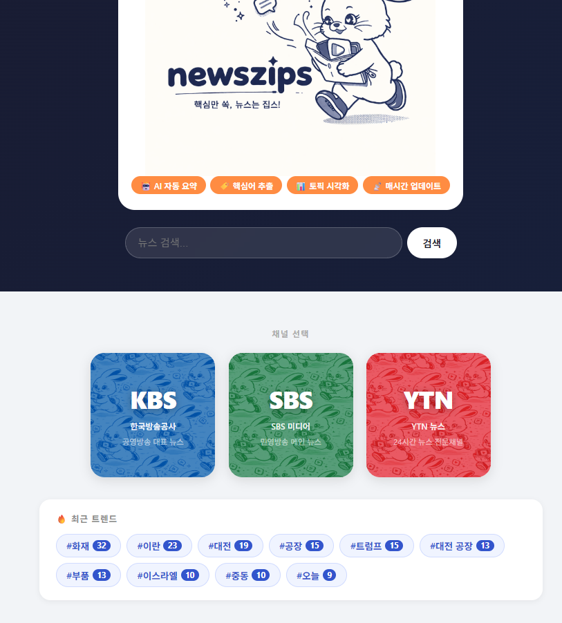
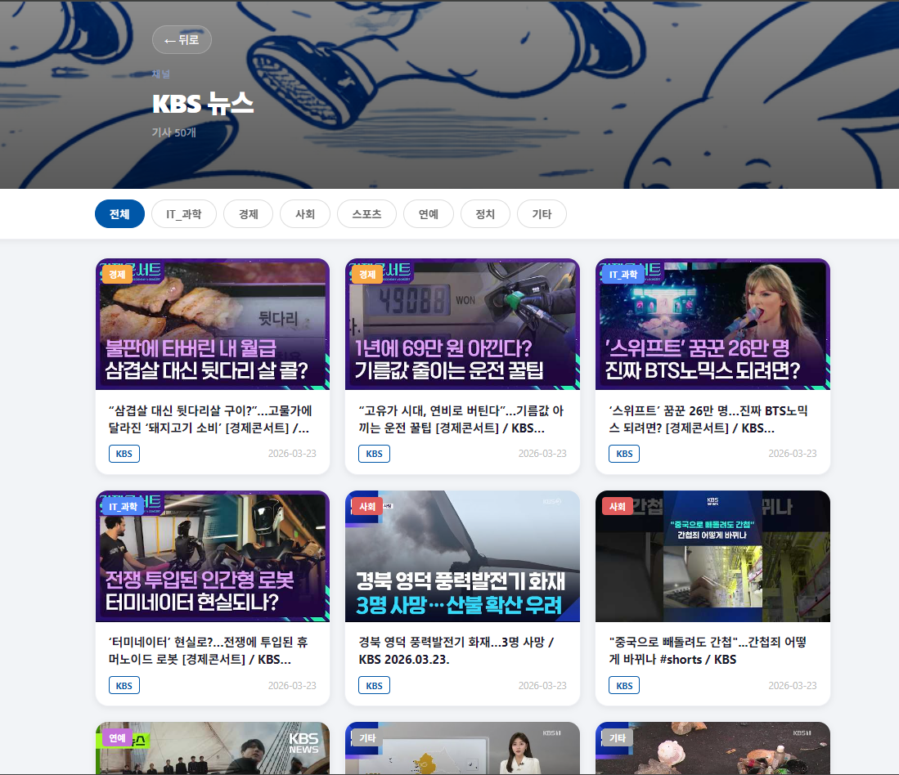
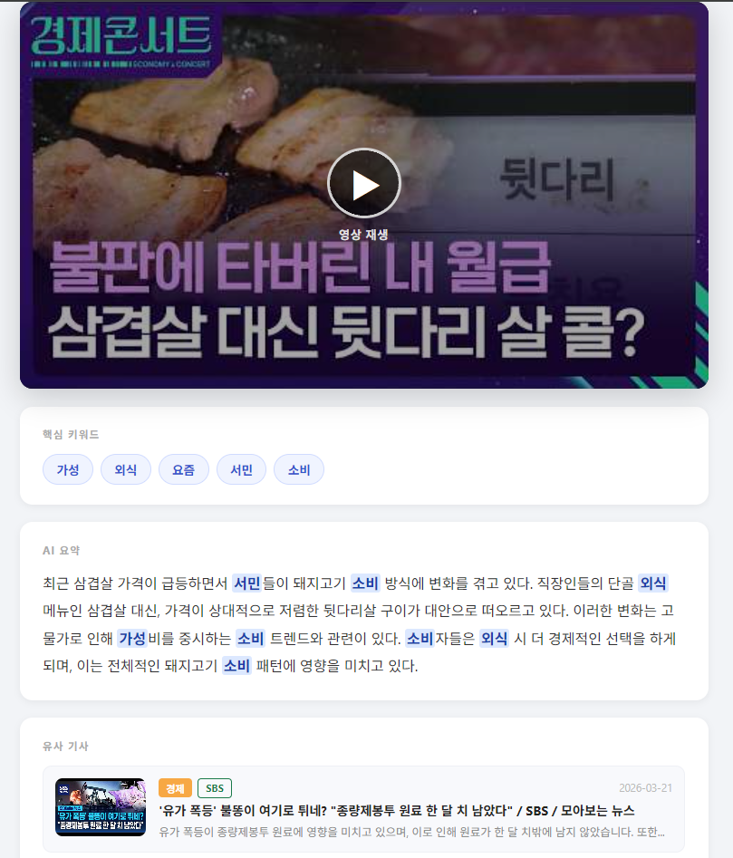
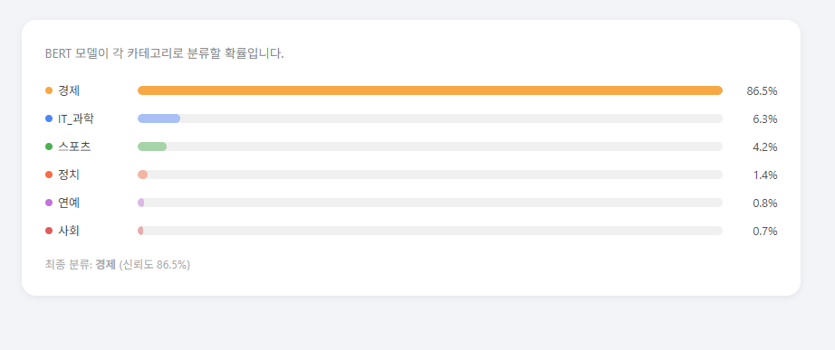
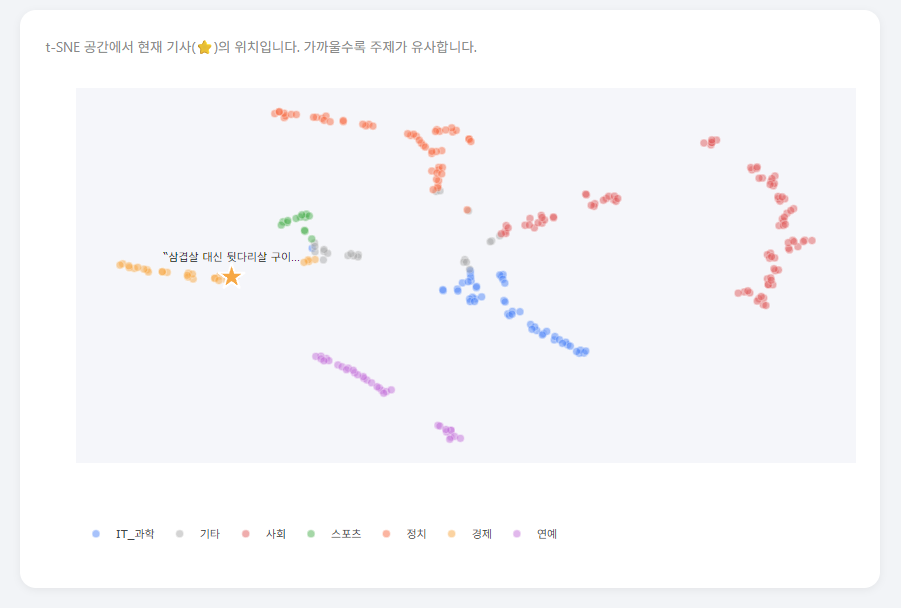
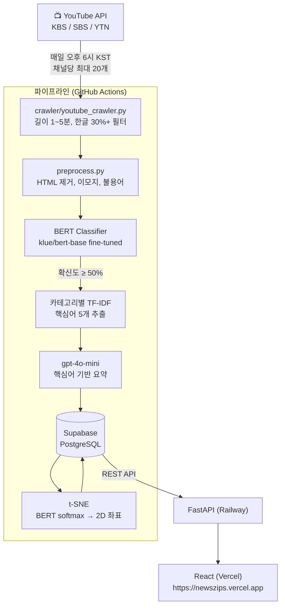

# Newszips

유튜브 뉴스 영상을 자동으로 수집해서 **카테고리 분류 → 핵심어 추출 → AI 요약 → 2D 시각화**까지 처리하는 풀스택 AI 파이프라인.

KBS·SBS·YTN 영상을 매일 자동으로 가져와, BERT로 분류하고 TF-IDF로 핵심어를 뽑은 뒤 gpt-4o-mini로 요약해 서비스한다. t-SNE로 기사 간 유사도를 2D 공간에 시각화하고, 유클리드 거리 기반 유사 기사 추천도 제공한다.

🌐 **라이브 서비스**: https://newszips.vercel.app

---

## 스크린샷

| 메인 화면 | 기사 리스트 |
|-----------|-------------|
|  |  |

| 기사 상세 | 분류 신뢰도 (Dev Tools) |
|-----------|------------------------|
|  |  |

| t-SNE 시각화 |
|--------------|
|  |

---

## 목차

1. [설계 결정](#1-설계-결정)
2. [시스템 아키텍처](#2-시스템-아키텍처)
3. [AI 파이프라인 상세](#3-ai-파이프라인-상세)
4. [BERT 분류 모델](#4-bert-분류-모델)
5. [t-SNE 시각화와 유사 기사 추천](#5-t-sne-시각화와-유사-기사-추천)
6. [프론트엔드](#6-프론트엔드)
7. [자동화 구조](#7-자동화-구조)
8. [배포 구조](#8-배포-구조)
9. [실행 방법](#9-실행-방법)
10. [디렉토리 구조](#10-디렉토리-구조)

---

## 1. 설계 결정

### LLM에 본문을 그대로 넘기지 않는 이유

뉴스 본문을 LLM에 바로 넘겨 요약을 요청하면 두 가지 문제가 생긴다.

첫째, **일관성 없음** — 같은 사건을 다룬 기사라도 문체나 도입부에 따라 요약이 달라진다. 둘째, **핵심 이탈** — LLM이 스스로 중요하다고 판단한 내용을 요약하기 때문에, 실제 뉴스의 핵심 사실보다 수식어나 맥락이 요약에 들어올 수 있다.

**해결책: TF-IDF로 핵심어를 먼저 추출하고, 그걸 프롬프트에 명시해서 LLM이 집중할 포인트를 유도한다.**

```python
prompt = f"""제목: {title}
핵심어: {', '.join(keywords)}   ← TF-IDF가 뽑은 핵심어 명시
기사 내용: {transcript}
→ 핵심어를 중심으로 3~5문장으로 요약하세요."""
```

### TF-IDF를 카테고리별로 분리한 이유

전체 corpus 기준으로 IDF를 계산하면 "대통령"이라는 단어가 정치 기사에서도, 스포츠 기사에서도 같은 가중치를 갖는다. 정치 기사에서 "대통령"은 흔한 단어지만, 스포츠 기사에서는 특이한 단어다. 카테고리 내부 IDF를 써야 그 기사에서 실제로 중요한 단어가 핵심어로 올라온다.

→ 6개 카테고리(IT_과학·경제·사회·스포츠·연예·정치)별로 TF-IDF vectorizer를 각각 학습해서 `.pkl` 파일로 저장.

### klue/bert-base를 선택한 이유

한국어 뉴스 분류다. 영어 사전학습 모델을 쓰면 한국어 형태소의 문맥을 제대로 잡지 못한다. klue/bert-base는 한국어 NLP 벤치마크(KLUE)에 맞춰 사전학습된 모델로, 한국어 뉴스 텍스트의 문맥을 가장 잘 이해한다.

---

## 2. 시스템 아키텍처



### 기술 스택

| 영역 | 기술 |
|------|------|
| 분류 | klue/bert-base fine-tuned (HuggingFace Hub) |
| 핵심어 추출 | 카테고리별 TF-IDF (scikit-learn) |
| 요약 | OpenAI gpt-4o-mini (temperature 0.3) |
| 임베딩 시각화 | t-SNE + Plotly.js |
| DB | Supabase (PostgreSQL) |
| 백엔드 | FastAPI → Railway |
| 프론트엔드 | React → Vercel |
| 자동화 | GitHub Actions (daily 09:00 UTC = 18:00 KST) |

---

## 3. AI 파이프라인 상세

### 전체 흐름

```
1. 크롤링 (crawler/youtube_crawler.py)
   ├─ YouTube Data API v3로 최근 24시간 영상 수집
   ├─ 필터: 60~300초, 한글 비율 30%+, video_id 중복 제거
   └─ Supabase articles 테이블에 원본 저장

2. 전처리 (pipeline/preprocess.py)
   ├─ HTML 엔티티 디코딩, 이모지 제거, URL 제거
   ├─ 브래킷 태그 제거 ([자막뉴스], [🔴LIVE] 등)
   ├─ 뉴스 불용어 제거 (뉴스, 기자, 앵커, 구독, 좋아요...)
   └─ transcript 컬럼 업데이트

3. 분류 + 핵심어 + 요약 (pipeline/classify_and_summarize.py)
   ├─ BERT로 6개 카테고리 분류 (확신도 < 50% → "기타")
   ├─ 카테고리별 TF-IDF로 상위 5개 핵심어 추출
   ├─ gpt-4o-mini에 카테고리 + 핵심어 + 본문 전달 → 3~5문장 요약
   └─ topic, topic_proba, keywords, summary 업데이트

4. t-SNE 좌표 계산 (pipeline/tsne.py)
   ├─ 전체 기사 BERT forward pass → softmax 확률값 (6차원)
   ├─ t-SNE로 2D 좌표 (x, y) 산출
   └─ articles 테이블 x, y 컬럼 업데이트
```

### t-SNE에 softmax 확률을 쓰는 이유

```python
# 마지막 hidden layer 대신 softmax 확률값 사용
probs = torch.softmax(outputs.logits, dim=-1).squeeze().cpu().numpy()  # (6,)
```

BERT의 마지막 hidden state를 쓰면 768차원이고 카테고리 간 분리가 흐릿하다. softmax 확률은 6차원이지만 카테고리 분리가 명확해서 t-SNE가 유의미한 클러스터를 만들어낸다. 같은 주제 기사끼리 가까이 모이고, 유클리드 거리가 실제 유사도를 잘 반영한다.

---

## 4. BERT 분류 모델

### 모델 히스토리

| 버전 | 카테고리 수 | 전체 정확도 | 변경 내용 |
|------|------------|------------|----------|
| v1 | 5개 | 97.0% | IT_과학·경제·스포츠·연예·정치 |
| v2 | 6개 | 96.0% | 사회 카테고리 추가 |

v2에서 정확도가 소폭 하락한 것처럼 보이지만, v1에서는 사회 뉴스가 다른 카테고리로 오분류되던 문제가 있었다. v2는 카테고리 커버리지를 넓힌 것이 실질적인 개선이다.

### 카테고리별 성능 (v2 기준)

| 카테고리 | 정확도 |
|---------|--------|
| IT_과학 | 94% |
| 경제 | 94% |
| 사회 | 98% |
| 스포츠 | 97% |
| 연예 | 98% |
| 정치 | 95% |
| **전체** | **96%** |

### 학습 구성

- **모델**: klue/bert-base
- **학습 환경**: Google Colab (GPU) — `classifier/train_bert_colab.ipynb`
- **학습 데이터**: `data/train_data.json` (직접 구성한 뉴스 레이블 데이터)
- **배포**: HuggingFace Hub (`SSEUNGSSEUNGWOO/newszips-classifier`)
  - Git에 모델 파일을 저장하지 않고, 파이프라인 실행 시 Hub에서 다운로드
- **추론 임계치**: 확신도 50% 미만 → "기타" 처리

---

## 5. t-SNE 시각화와 유사 기사 추천

### t-SNE 페이지 (`/tsne`)

전체 기사를 2D 공간에 뿌려서 카테고리별 클러스터링을 시각화한다. Plotly.js로 인터랙티브하게 렌더링하고, 특정 기사를 선택하면 해당 위치에 별 모양 마커로 하이라이트된다.

### 유사 기사 추천

별도 추천 모델 없이 t-SNE 좌표 간 유클리드 거리를 API에서 실시간 계산한다.

```python
# api/main.py
distance = float(np.sqrt((a["x"] - tx) ** 2 + (a["y"] - ty) ** 2))
```

같은 사건을 다룬 기사들은 t-SNE 공간에서 가까이 모이기 때문에, 거리순 정렬이 곧 유사도순 정렬이 된다.

---

## 6. 프론트엔드

### 주요 화면

| 경로 | 기능 |
|------|------|
| `/` | 언론사 선택 (KBS / SBS / YTN) + 최근 48시간 트렌드 키워드 |
| `/articles` | 기사 그리드 — 카테고리 필터, 키워드 검색, 텍스트 검색 |
| `/articles/:id` | 기사 상세 — 영상 재생, AI 요약, 핵심어 하이라이트, 유사 기사 |
| `/tsne` | 전체 기사 2D 임베딩 시각화 |
| `/dev/:id` | 개발자 도구 — 분류 신뢰도 차트, t-SNE 위치, 유사도 거리 목록 |

### 핵심어 하이라이트

본문에서 TF-IDF가 추출한 핵심어를 정규식으로 찾아 `<mark>` 태그로 강조한다. 핵심어를 드래그하면 Naver 사전·Google 검색 팝업이 뜬다.

```javascript
function highlightKeywords(text, keywords) {
  const pattern = new RegExp(
    `(${keywords.map(k => k.replace(/[.*+?^${}()|[\]\\]/g, '\\$&')).join('|')})`, 'g'
  );
  return text.split(pattern).map((part, i) =>
    keywords.includes(part) ? <mark key={i}>{part}</mark> : part
  );
}
```

---

## 7. 자동화 구조

GitHub Actions가 매일 오후 6시(KST)에 전체 파이프라인을 실행한다. 로컬 환경을 켜둘 필요 없이 새 영상이 자동으로 수집·처리·서비스된다.

```yaml
# .github/workflows/crawl.yml
on:
  schedule:
    - cron: '0 9 * * *'   # 09:00 UTC = 18:00 KST
```

실행 순서: 크롤링 → 전처리 → 분류·핵심어·요약 → t-SNE 좌표 계산

---

## 8. 배포 구조

```
사용자 브라우저
    ↓
Vercel (React 프론트엔드)
    ↓ API 호출
Railway (FastAPI 백엔드)
    ↓ DB 조회
Supabase (PostgreSQL)
```

### API 엔드포인트

| Method | Path | 설명 |
|--------|------|------|
| GET | `/articles` | 기사 목록 (company, category, keyword, search 필터) |
| GET | `/articles/{id}` | 기사 상세 |
| GET | `/articles/{id}/related` | 유사 기사 (유클리드 거리 기준) |
| GET | `/tsne` | t-SNE 좌표 전체 |
| GET | `/trends` | 최근 48시간 키워드 빈도 |
| GET | `/stats` | 전체 통계 (언론사별, 카테고리별) |

---

## 9. 실행 방법

### 환경변수 (.env)

```env
SUPABASE_URL=
SUPABASE_KEY=
OPENAI_API_KEY=
YOUTUBE_API_KEY=
HF_TOKEN=        # HuggingFace Hub 모델 다운로드용
```

GitHub Actions Secrets에도 동일하게 설정 필요.

### 파이프라인 전체 실행

```bash
pip install -r requirements.pipeline.txt
python pipeline/run_pipeline.py
```

### 백엔드 실행

```bash
pip install -r requirements.api.txt
uvicorn api.main:app --reload --port 8000
```

### 프론트엔드 실행

```bash
cd frontend
npm install
npm start
```

### BERT 모델 학습

`classifier/train_bert_colab.ipynb`를 Google Colab(GPU)에서 실행.
학습 완료 후 HuggingFace Hub에 업로드하면 파이프라인이 자동으로 가져온다.

---

## 10. 디렉토리 구조

```
newszips/
├── classifier/
│   ├── train_bert_colab.ipynb     # BERT 분류기 학습 (Colab GPU)
│   ├── train_tfidf_colab.ipynb    # TF-IDF vectorizer 학습 (Colab CPU)
│   └── prepare_data.py
│
├── pipeline/
│   ├── run_pipeline.py            # 전체 파이프라인 실행 진입점
│   ├── preprocess.py              # 텍스트 클렌징, 불용어 제거
│   ├── classify_and_summarize.py  # BERT 분류 → TF-IDF 핵심어 → GPT 요약
│   └── tsne.py                    # BERT softmax → t-SNE 2D 좌표
│
├── crawler/
│   └── youtube_crawler.py         # YouTube API 크롤러 (KBS, SBS, YTN)
│
├── models/
│   ├── klue_bert_classifier/      # fine-tuned BERT (HuggingFace에도 업로드)
│   └── tfidf_vectorizers/         # 카테고리별 TF-IDF vectorizer × 6개 (.pkl)
│
├── api/
│   └── main.py                    # FastAPI 서버 (6개 엔드포인트)
│
├── frontend/
│   └── src/pages/
│       ├── SelectCompany.js       # 언론사 선택 + 트렌드 키워드
│       ├── ArticleList.js         # 기사 카드 그리드
│       ├── ArticleDetail.js       # 기사 상세 + 핵심어 하이라이트
│       ├── TsnePage.js            # t-SNE 2D 시각화
│       └── DevPage.js             # 개발자 도구 대시보드
│
├── data/
│   └── train_data.json            # BERT 학습 데이터
│
└── .github/workflows/
    └── crawl.yml                  # 매일 오후 6시 KST 자동 실행
```
